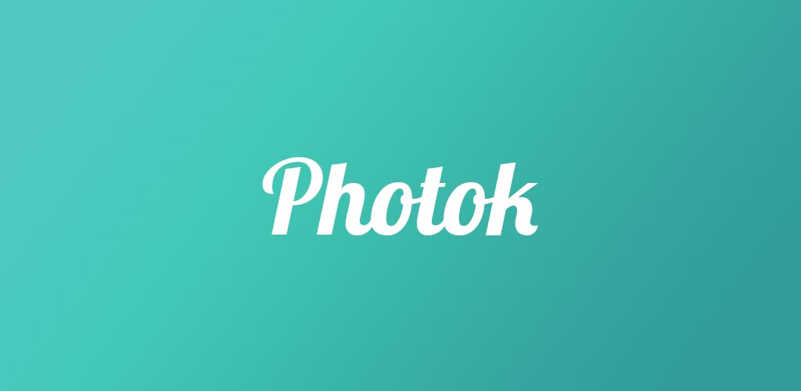

Encrypt images and videos on your device and keep them safe from others.

## About
Photok is a free and open-source gallery app for Android.
Imported media files are encrypted on the device using AES-256 and only decrypted in memory when using the app.
This makes Photok different from other encrypted gallery apps.

Photok is completely free, open source, and ad-free. It is developed as a hobby by me (Leon) and public volunteers.

## Download
Photok is available at Google Play and F-Droid. Aswell as some alternatives.

## Translations
<!-- BEGIN-TRANSLATIONS -->

-100%25-brightgreen)

-67%25-orange)

<!-- END-TRANSLATIONS -->

> You want to help translating Photok? See [CONTRIBUTING](CONTRIBUTING.md#Translations)

## Related Tools

LICENSE
=======
    Copyright 2020-2025 Leon Latsch

    Licensed under the Apache License, Version 2.0 (the "License");
    you may not use this file except in compliance with the License.
    You may obtain a copy of the License at

        http://www.apache.org/licenses/LICENSE-2.0

    Unless required by applicable law or agreed to in writing, software
    distributed under the License is distributed on an "AS IS" BASIS,
    WITHOUT WARRANTIES OR CONDITIONS OF ANY KIND, either express or implied.
    See the License for the specific language governing permissions and
    limitations under the License.

**Legal Notice**

Google Play and the Google Play logo are trademarks of Google LLC
