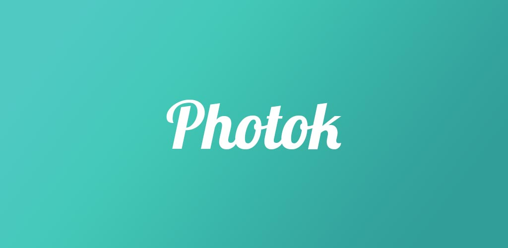

## README
- [🇬🇧 Engels](README.md)

Versleutel uw foto's op uw apparaat en houd ze veilig voor anderen.

## Over
Photok is een gratis Photo-Safe. Het slaat uw foto's versleuteld op uw apparaat op en verbergt ze voor anderen.
Het maakt gebruik van technologieën zoals AES-256-coderingsstandaard of bcrypt, om uw foto's veilig te houden.
Photok is volledig gratis, open source en bevat geen advertenties. 

## Download
Photok is beschikbaar op Google Play en F-Droid. Evenals enkele alternatieven. 

      
Alternatief 1: [Direct Download APK](https://github.com/leonlatsch/Photok/releases/latest)

Alternatief 2: [F-Droid (IzzyOnDroid)](https://apt.izzysoft.de/fdroid/index/apk/dev.leonlatsch.photok)

## Vertalingen
<!-- BEGIN-VERTALINGEN -->

onderhouden door @leonlatsch

-100%25-brightgreen)
onderhouden door @sr093906

onderhouden door @leonlatsch

-100%25-brightgreen)
onderhouden door @mezysinc

onderhouden door @Ismael034

<!-- EINDVERTALINGEN -->

LICENTIE
=======
    Copyright 2020-2021 Leon Latsch

     Gelicentieerd onder de Apache-licentie, versie 2.0 (de "licentie");
     u mag dit bestand alleen gebruiken in overeenstemming met de licentie.
     U kunt een kopie van de licentie verkrijgen op:

         http://www.apache.org/licenses/LICENSE-2.0

     Tenzij vereist door de toepasselijke wetgeving of schriftelijk overeengekomen, is software
     gedistribueerd onder de licentie wordt gedistribueerd op een "AS IS"-BASIS,
     ZONDER ENIGE GARANTIE OF VOORWAARDEN, expliciet of impliciet.
     Zie de Licentie voor de specifieke taal die machtigingen regelt en
     beperkingen onder de Licentie. 

**Juridische kennisgeving**

Google Play en het Google Play-logo zijn handelsmerken van Google LLC 
